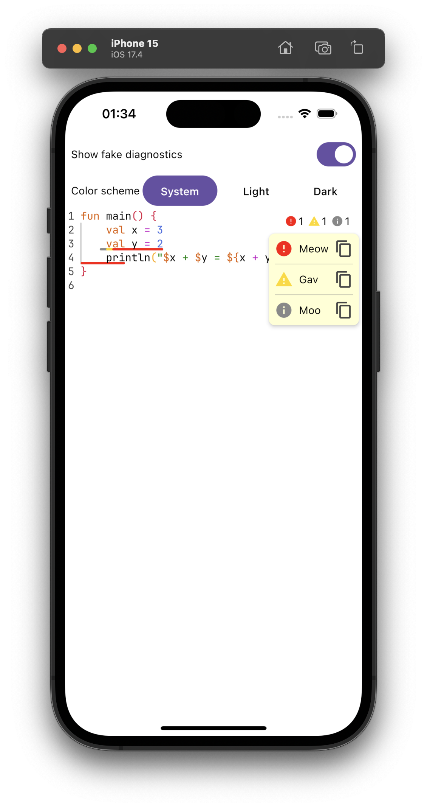
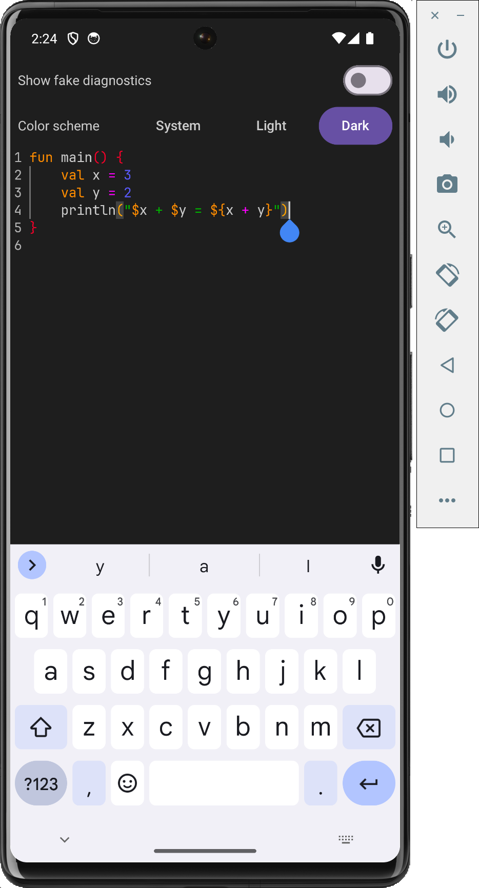
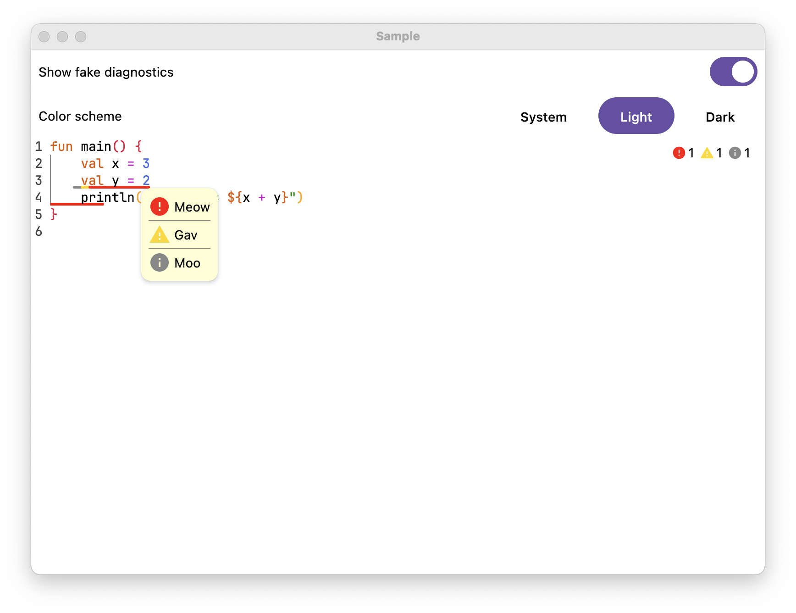

# KotlinSourceTextField

This project provides customizable Kotlin source code editor for Compose Multiplatform (Desktop, Android, iOS).

<div style="flex-wrap: wrap; align-self: center">



</div>

<video width="640" height="480" controls>
    <source src="readmeMedia/desktop_usage.mp4" type="video/mp4">
    Your browser does not support the video tag.
</video>


It uses [BasicSourceCodeEditor](https://github.com/zhelenskiy/BasicSourceCodeEditor) under the hood.

Customization can be done in the several ways:
* Additional features
* Color schemes
* Visual settings

### Additional features

Each of the following features can be opt-out.

- Indentation
- Sticky Header
- Line Numbers
- Rainbow Brackets
- Find&Replace
- Highlighting Diagnostics
- Diagnostics Popup
- Diagnostics Tooltip
- Highlighting Matching Brackets at Current Position
- Underlining Current Identifier Usages
- Various typing events helpers (exact key bindings are also customizable):
    - Code indentation with Tab/Shift + Tab
    - Reusing Following Closing Bracket
    - Reusing Closing Char Quote
    - Reusing Closing String Quote
    - Adding Closing Bracket
    - Adding Closing Char Quote
    - Adding Closing Single Line String Quote
    - Adding Closing MultiLine String Quote
    - Indenting Closing Bracket
    - Indenting New Line
    - Removing indent On Backspace
    - Removing Following Closing Bracket
    - Removing Following Closing Char Quote
    - Removing Following Closing String Quote
    - Duplicating strings and lines
    - Wrapping and unwrapping with block comments

To choose the options there is `sourceEditorFeaturesConfiguration` parameter in the main entry point functions.

### Color schemes.
There are 2 predefined themes templates: for dark and light themes.

They are generated with `makeLightColorScheme` and `makeDarkColorScheme` functions

However, you can create a new one or customize the existing ones.

To choose the color scheme, you need to specify `colorScheme` parameter.


### Visual settings

Visual settings specify scrollbars visibility, additional paddings, fonts, etc.
The default font for source areas is JetBrains Mono.

To choose the custom visual settings, you need to specify `visualSettings` parameter.

## Usage

To use the library, you need to use `KotlinSourceEditor` composable function.

You can see its usage in the `sample` submodule.

It is approximately the following:

```kotlin
var textFieldValue by remember { mutableStateOf(TextFieldValue("")) }

val fakeDiagnostics = listOf(
    DiagnosticDescriptor("Meow", DiagnosticSeverity.ERROR, TextInterval(TextPosition(2, 5), TextPosition(3, 7))),
    DiagnosticDescriptor("Gav", DiagnosticSeverity.WARNING, TextInterval(TextPosition(2, 4), TextPosition(3, 6))),
    DiagnosticDescriptor("Moo", DiagnosticSeverity.INFO, TextInterval(TextPosition(2, 3), TextPosition(3, 5))),
)
KotlinSourceEditor(
    textFieldValue = textFieldValue,
    onTextFieldValueChange = { textFieldValue = it },
    modifier = Modifier.fillMaxSize(),
    colorScheme = ...,
    sourceEditorFeaturesConfiguration = KotlinSourceEditorFeaturesConfiguration(),
    snackbarHostState = ...,
    diagnostics = fakeDiagnostics,
)
```